# Sistema de Gerenciamento de Funcionários e Departamentos

## Estrutura
- Controllers (REST e MVC)
- DTO (Data Transfer Object - entrada/saída)
- Model (Entidades JPA)
- Repository (JPA)
- Service (Lógica de negócio)

## Executando localmente

1. Ajuste `src/main/resources/application.properties` com as credenciais do MariaDB.
2. Crie o banco de dados "empresa".
3. Rode a aplicação.
4. Acesse: `http://localhost:8080`

## Exemplos de requisições Postman:
GET:
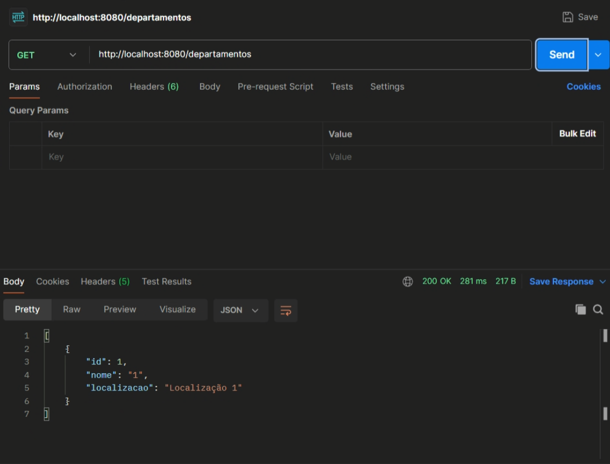

POST:
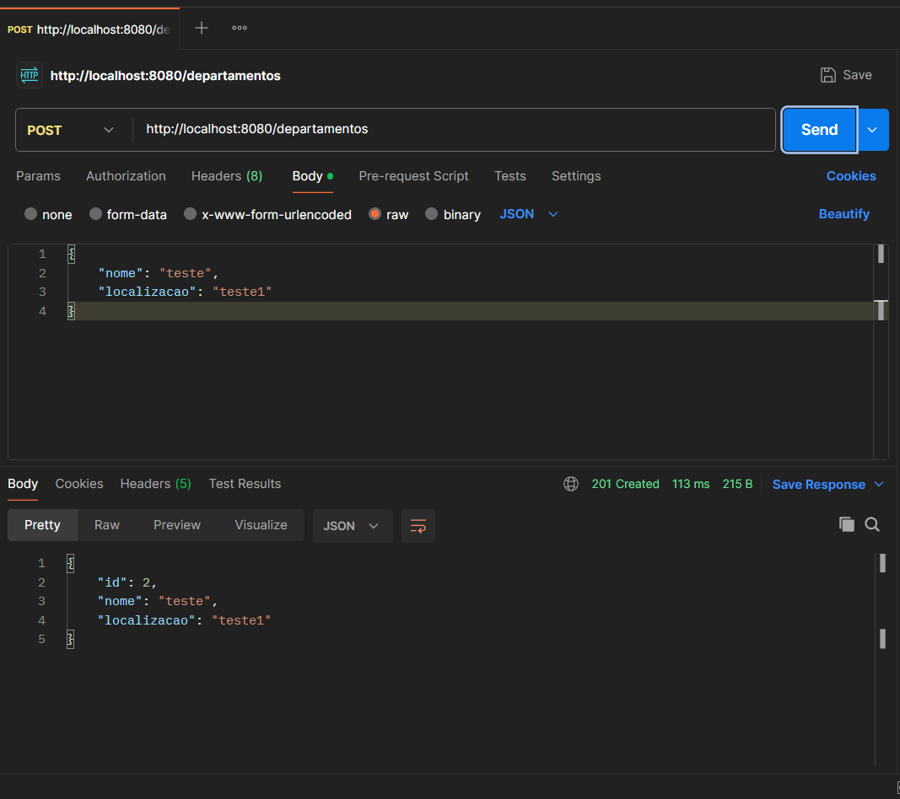

PUT:
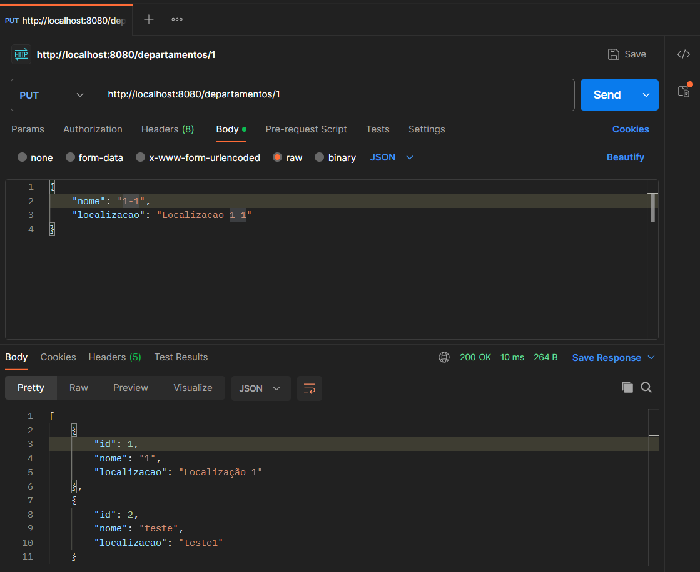

GET BY ID:
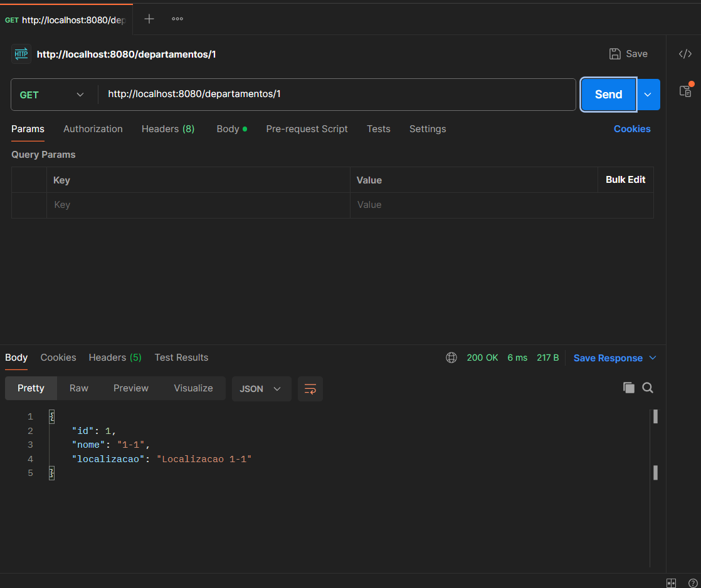

DELETE:
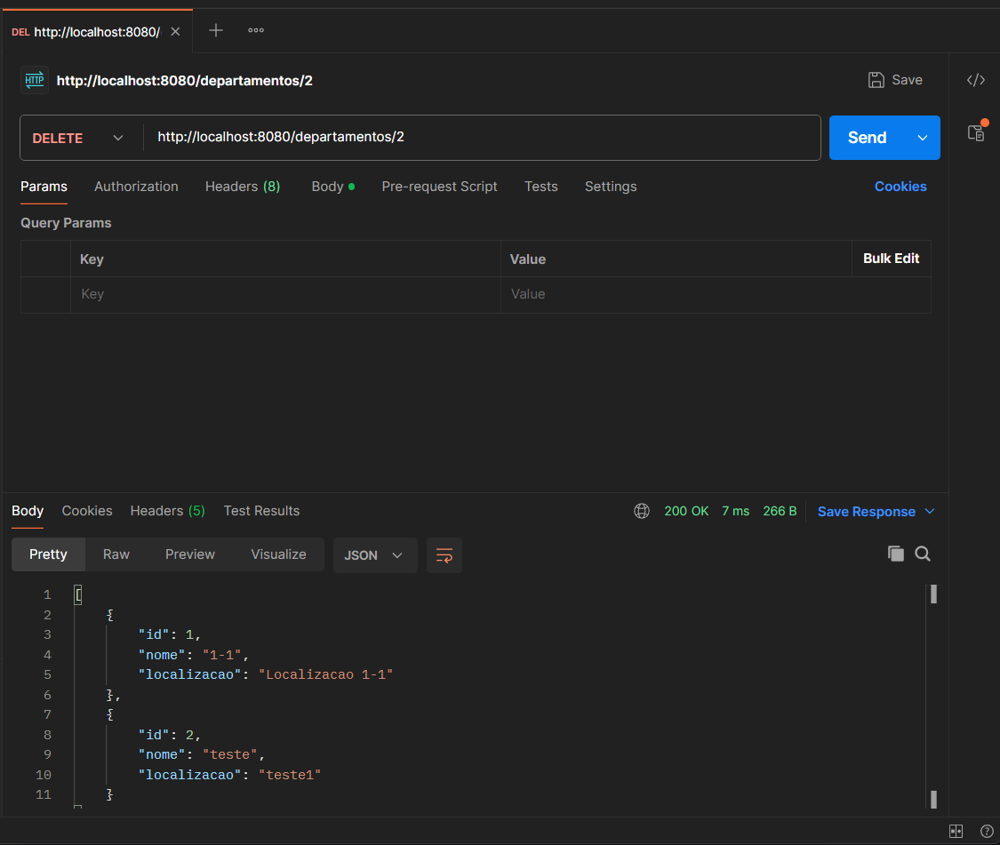

GET em Funcionarios:
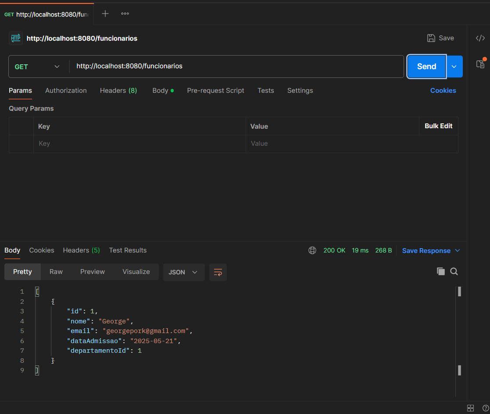

GET BY ID em Funcionarios:
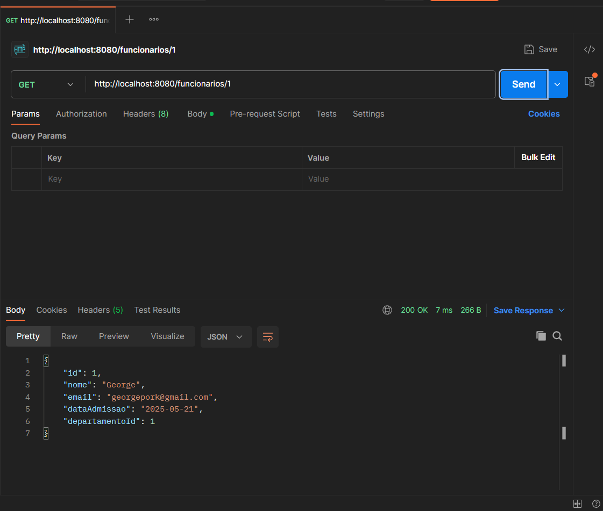

POST em Funcionarios:
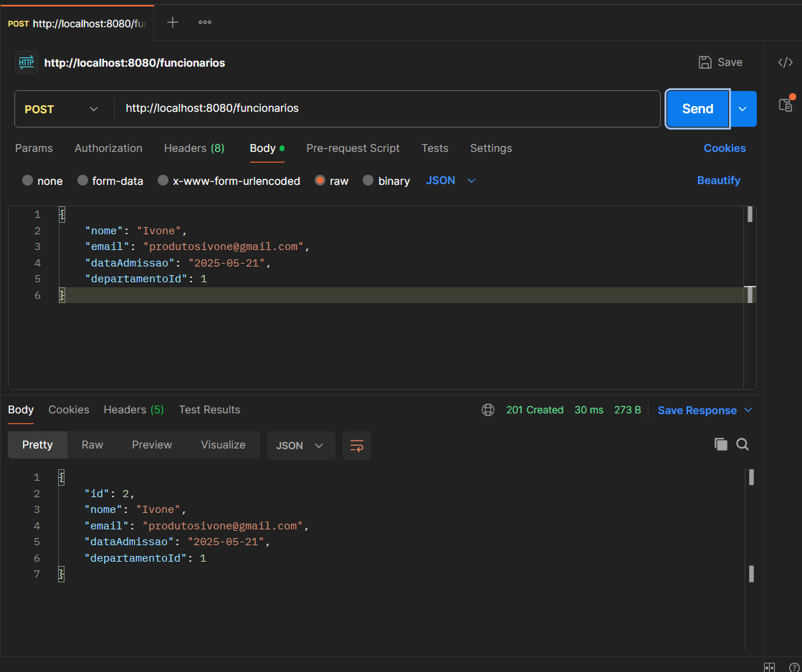

PUT em Funcionarios:
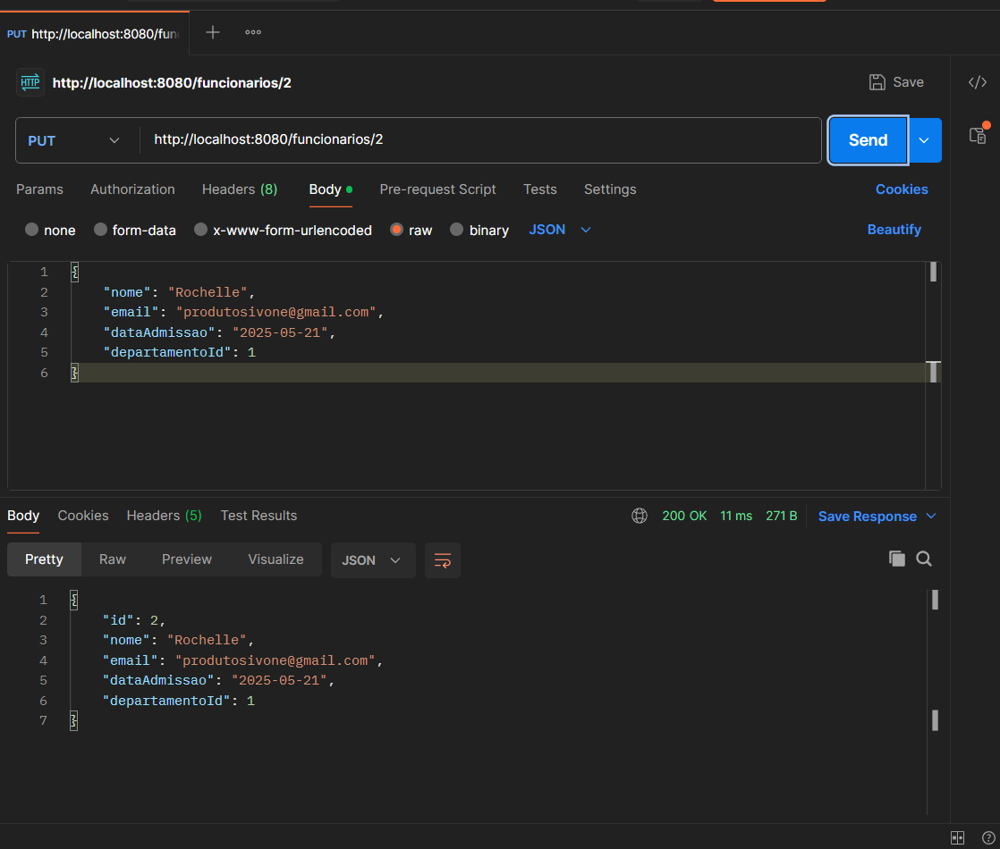

DELETE em Funcionarios:
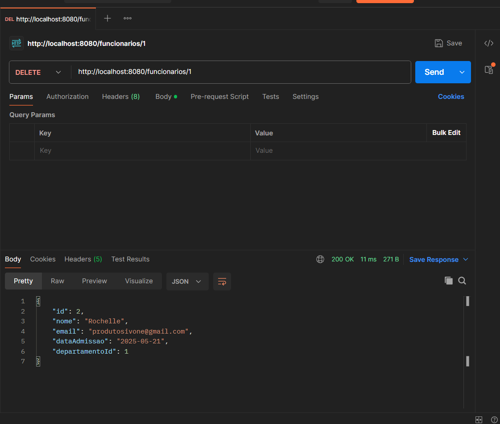

Resultado após deletar um funcionário:
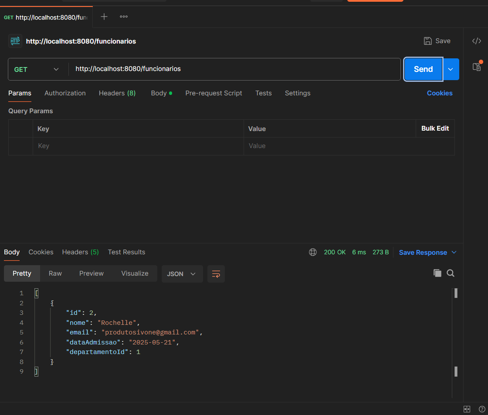
